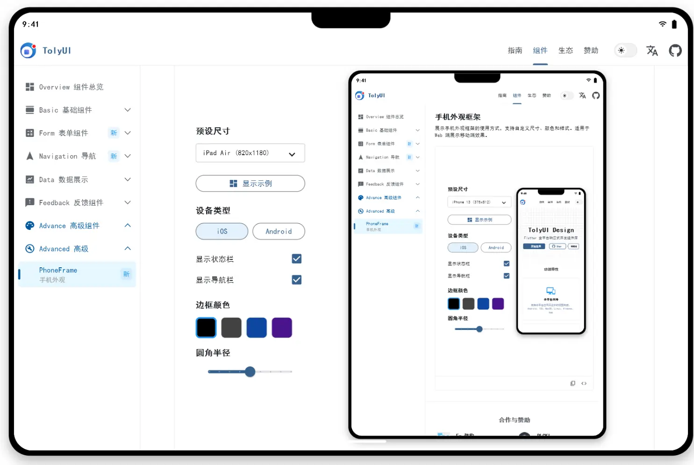
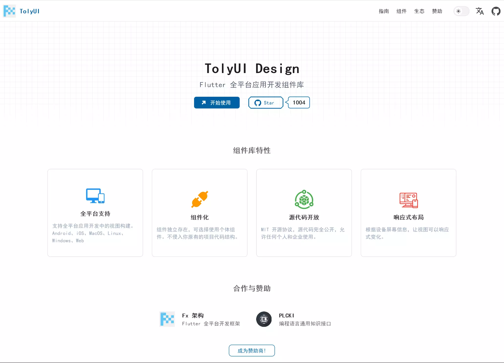
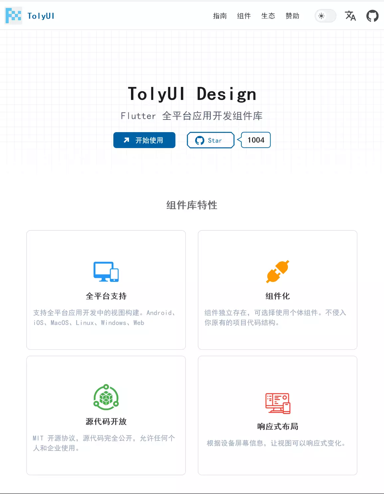
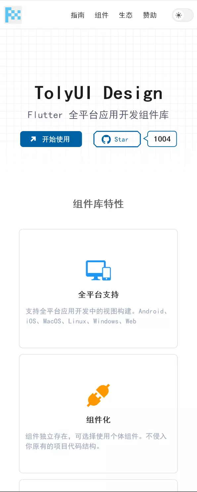

# TolyUI

<p align="center">
  
</p>

<p align="center">
  <strong>为 Flutter 开发者打造的现代化 UI 组件库</strong>
</p>

<p align="center">
  <a href="http://toly1994.com/ui">在线演示</a> |
  <a href="#快速开始">快速开始</a> |
  <a href="#组件列表">组件列表</a> |
  <a href="#贡献指南">贡献</a>
</p>

---

## 简介

TolyUI 是一个致力于提供高质量、易用且美观的 Flutter UI 组件库。采用模块化设计，每个组件都可以独立使用，让你的 Flutter 应用开发更加高效。

### 特性

- 🎨 **精美设计** - 现代化的视觉风格，注重细节和用户体验
- 🧩 **模块化架构** - 组件独立打包，按需引入，减小应用体积
- 📱 **响应式布局** - 适配不同屏幕尺寸，支持桌面和移动端
- 🎯 **类型安全** - 完整的类型定义，提供更好的开发体验
- 📚 **丰富文档** - 详细的使用文档和示例代码
- ⚡ **高性能** - 优化的渲染性能，流畅的动画效果

### 预览

| 基础组件 | 表单组件 | 数据展示 |
|---------|---------|----------|
|  |  |  |

**在线演示**: [http://toly1994.com/ui](http://toly1994.com/ui)

---

## 快速开始

### 安装

在 `pubspec.yaml` 中添加依赖：

```yaml
dependencies:
  tolyui: #最新版本
```

或者使用独立模块：

```yaml
dependencies:
  toly_tag: #最新版本
  toly_tree: #最新版本
```

---

## 组件列表

### 基础组件 (Basic)

- **Button** - 按钮组件，支持多种样式和状态
- **Icon** - 图标组件
- **Text** - 文本组件，支持富文本
- **Link** - 链接组件
- **Layout** - 布局组件
- **Action** - 操作组件

### 表单组件 (Form)

- **Input** - 输入框，支持前缀、后缀、清除按钮
- **Select** - 选择器
- **Checkbox** - 多选框
- **Radio** - 单选按钮
- **Switch** - 开关
- **Slider** - 滑块
- **DatePicker** - 日期选择器
- **ColorPicker** - 颜色选择器
- **Autocomplete** - 自动补全
- **Transfer** - 穿梭框

### 导航组件 (Navigation)

- **Tabs** - 标签页
- **Steps** - 步骤条
- **Breadcrumb** - 面包屑
- **Anchor** - 锚点
- **DropMenu** - 下拉菜单
- **RailMenuBar** - 侧边栏菜单
- **RailMenuTree** - 树形菜单

### 数据展示 (Data)

- **Tree** - 树形控件，支持虚拟滚动、异步加载、拖拽排序
- **Table** - 表格
- **Tag** - 标签
- **Card** - 卡片
- **Collapse** - 折叠面板
- **Avatar** - 头像
- **Badge** - 徽章
- **Progress** - 进度条
- **Pagination** - 分页
- **Skeleton** - 骨架屏
- **Image** - 图片
- **Segmented** - 分段控制器
- **Statistics** - 数据统计
- **Carousel** - 轮播图
- **Watermark** - 水印
- **Default** - 缺省页

### 反馈组件 (Feedback)

- **Message** - 消息提示
- **Notification** - 通知
- **Loading** - 加载
- **Tooltip** - 文字提示
- **Popover** - 弹出框
- **Shortcuts** - 快捷键

### 高级组件 (Advanced)

- **Color** - 调色板
- **DeviceFrame** - 设备外观

---

## 模块化架构

TolyUI 采用模块化设计，每个组件都是独立的 Flutter package，可以单独引入使用：

```
modules/
├── basic/          # 基础组件
├── form/           # 表单组件
├── navigation/     # 导航组件
├── data/           # 数据展示组件
│   ├── toly_tree/
│   ├── toly_collapse/
│   └── ...
├── feedback/       # 反馈组件
└── advanced/       # 高级组件
```

这种设计带来的好处：

- ✅ **按需引入** - 只引入需要的组件，减小应用体积
- ✅ **独立维护** - 每个模块独立开发和测试
- ✅ **版本管理** - 组件可以独立升级
- ✅ **灵活组合** - 根据项目需求自由组合

---

## 开发指南

### 项目结构

```
toly_ui/
├── lib/                    # 主应用代码
│   ├── view/
│   │   └── widgets/       # 组件演示页面
│   ├── navigation/        # 路由和菜单
│   └── app/               # 应用配置
├── modules/               # 独立组件模块
├── doc/                   # 文档和资源
│   ├── articles/         # 组件文档
│   └── screenshot/       # 截图
├── test/                  # 测试和脚本
│   └── script/           # 自动化脚本
└── assets/               # 静态资源
```

### 开发命令

```bash
# 运行应用
flutter run

# 生成路由和代码资源
toly ui

# 创建新模块
dart test/script/create_module.dart <module_name> <category>

# 集成组件
dart test/script/integrate_component.dart <component_name> <module> <label> <subtitle>
```

### 添加新组件

1. 使用脚本创建模块骨架
2. 在 `lib/src/` 实现组件
3. 创建演示案例（demo 文件）
4. 添加 `@DisplayNode` 注解
5. 更新路由和菜单配置
6. 运行 `toly ui` 生成资源

详细步骤请参考 [组件集成规范](.amazonq/rules/component_integration.md)

---

## 贡献指南

我们欢迎所有形式的贡献，包括但不限于：

- 🐛 报告 Bug
- 💡 提出新功能建议
- 📝 改进文档
- 🔧 提交代码修复
- ⭐ Star 项目支持

### 提交 PR

1. Fork 本仓库
2. 创建特性分支 (`git checkout -b feature/AmazingFeature`)
3. 提交更改 (`git commit -m 'Add some AmazingFeature'`)
4. 推送到分支 (`git push origin feature/AmazingFeature`)
5. 开启 Pull Request

---

## 社区与支持

- **QQ 交流群**: 1046304516
- **掘金**: [@张风捷特烈](https://juejin.cn/user/149189281194766)
- **B站**: [@张风捷特烈](https://space.bilibili.com/390457600)
- **公众号**: 编程之王
- **GitHub**: [TolyFx/toly_ui](https://github.com/TolyFx/toly_ui)

---

## 开源协议

MIT License - 详见 [LICENSE](LICENSE) 文件

---

## 致谢

感谢所有为 TolyUI 做出贡献的开发者！

### 开源不易，请我喝咖啡 ☕

<p align="center">
  
</p>

---

<p align="center">
  Made with ❤️ by <a href="https://github.com/toly1994328">张风捷特烈</a>
</p>