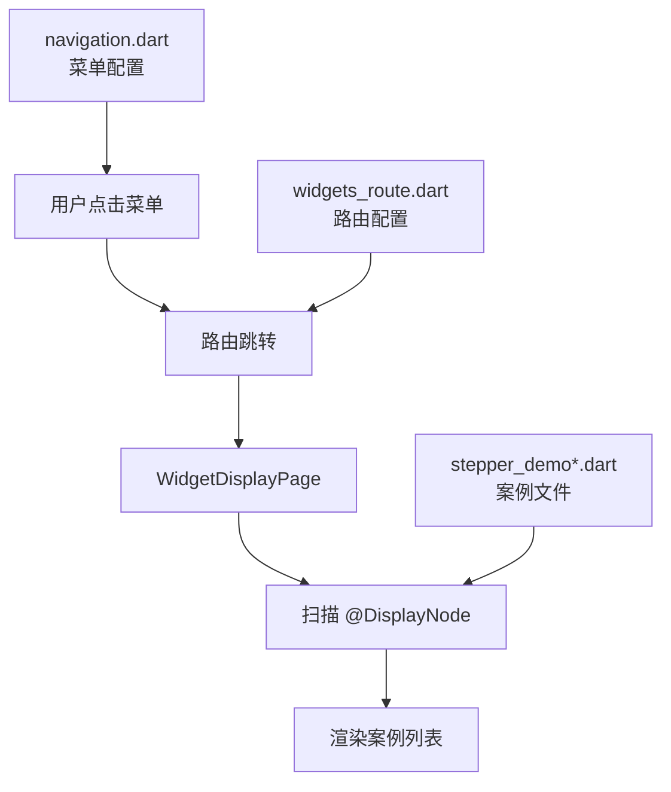
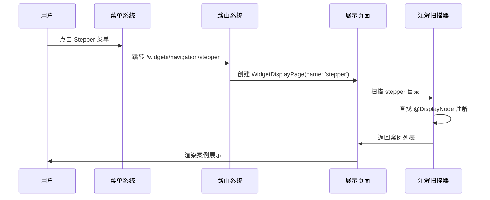
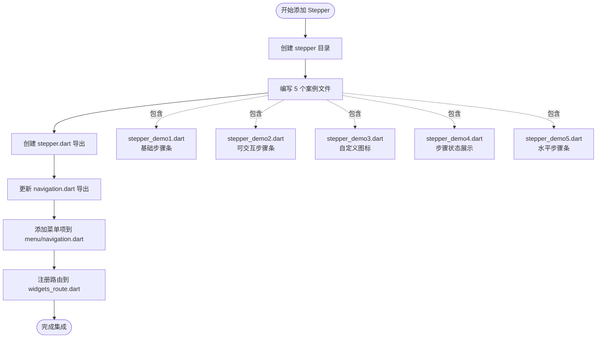

# TolyUI 组件集成指南

本文档说明如何在 TolyUI 框架中添加新组件和案例，并将其集成到导航和展示系统中。

## 目录结构

```
lib/
├── view/widgets/              # 组件展示层
│   ├── navigation/           # 导航模块
│   │   ├── stepper/         # 步骤条组件
│   │   │   ├── stepper_demo1.dart
│   │   │   ├── stepper_demo2.dart
│   │   │   └── stepper.dart  # 导出文件
│   │   └── navigation.dart   # 模块导出
│   └── widgets.dart          # 顶层导出
├── navigation/
│   ├── menu/                 # 菜单配置
│   │   ├── navigation.dart   # 导航菜单
│   │   └── widget_menus.dart # 菜单汇总
│   └── router/               # 路由配置
│       └── widgets_route.dart
```

## 集成流程

### 一、创建组件案例

在对应模块目录下创建案例文件，使用 `@DisplayNode` 注解标注：

```dart
import 'package:flutter/material.dart';
import 'package:toly_ui/view/widgets/display_nodes/display_nodes.dart';

@DisplayNode(
  title: '基础步骤条',
  desc: '展示步骤条的基本用法。通过 currentStep 控制当前步骤...',
)
class StepperDemo1 extends StatelessWidget {
  const StepperDemo1({super.key});

  @override
  Widget build(BuildContext context) {
    return Stepper(
      currentStep: 1,
      steps: const [
        Step(title: Text('步骤一'), content: SizedBox.shrink()),
        Step(title: Text('步骤二'), content: SizedBox.shrink()),
      ],
    );
  }
}
```

### 二、组织导出文件

在组件目录下创建导出文件 `stepper.dart`：

```dart
export 'stepper_demo1.dart';
export 'stepper_demo2.dart';
export 'stepper_demo3.dart';
```

在模块导出文件 `navigation.dart` 中添加：

```dart
export 'stepper/stepper.dart';
```

### 三、配置导航菜单

在 `lib/navigation/menu/navigation.dart` 的 `navigationMenus` 中添加菜单项：

```dart
Map<String, dynamic> get navigationMenus => {
  'path': '/widgets/navigation',
  'label': 'Navigation 导航',
  'children': [
    {
      'path': '/stepper',
      'label': 'Stepper',
      'subtitle': '步骤条',
    },
    // 其他菜单项...
  ]
};
```

### 四、注册路由

在 `lib/navigation/router/widgets_route.dart` 的对应路由组中添加：

```dart
GoRoute(
  path: "navigation",
  builder: (BuildContext context, GoRouterState state) {
    return WidgetsPage();
  },
  routes: [
    _customRoute('stepper'),  // 添加这一行
    // 其他路由...
  ]
)
```

## 系统架构



## 数据流向



## 文件关系图

```mermaid
graph LR
    A[stepper_demo1.dart<br/>@DisplayNode] --> B[stepper.dart<br/>export]
    C[stepper_demo2.dart<br/>@DisplayNode] --> B
    D[stepper_demo3.dart<br/>@DisplayNode] --> B
    
    B --> E[navigation.dart<br/>export]
    E --> F[widgets.dart<br/>export]
    
    G[navigation.dart<br/>菜单配置] --> H[widget_menus.dart]
    I[widgets_route.dart<br/>路由配置] --> J[app_router.dart]
    
    F -.自动扫描.-> K[WidgetDisplayPage]
    H -.菜单数据.-> K
    J -.路由跳转.-> K
```

## 集成检查清单

添加新组件时，请确认以下步骤：

**文件组织**
- [ ] 创建组件目录 `lib/view/widgets/{module}/{component}/`
- [ ] 编写案例文件 `{component}_demo*.dart`
- [ ] 每个案例添加 `@DisplayNode` 注解
- [ ] 创建组件导出文件 `{component}.dart`
- [ ] 在模块导出文件中添加 `export '{component}/{component}.dart'`

**导航集成**
- [ ] 在 `lib/navigation/menu/{module}.dart` 中添加菜单项
- [ ] 配置 `path`、`label`、`subtitle` 字段
- [ ] 可选：添加 `icon` 和 `tag` 字段

**路由配置**
- [ ] 在 `lib/navigation/router/widgets_route.dart` 中添加路由
- [ ] 使用 `_customRoute('{component}')` 注册路由
- [ ] 确保路由路径与菜单 path 一致

**案例规范**
- [ ] 标题简洁明确
- [ ] 描述详细完整，包含功能说明、交互细节、应用场景
- [ ] 代码遵循数据驱动模式
- [ ] 简单案例用 StatelessWidget，交互案例用 StatefulWidget
- [ ] 使用白话文描述，禁止使用 emoji

## 核心原则

TolyUI 的组件展示系统基于约定优于配置的设计理念：

1. **自动发现**：通过 `@DisplayNode` 注解自动识别案例，无需手动注册
2. **模块化**：每个组件独立目录，清晰的导出层级
3. **渐进式**：案例按从简单到复杂的顺序组织
4. **实用导向**：每个案例都应该能直接应用到实际项目

只需完成三个核心步骤（编写案例、添加菜单、注册路由），其余的展示、识别、渲染都由框架自动完成。

## 示例：添加 Stepper 组件



## 常见问题

**Q: 为什么我的案例没有显示在展示页面？**

A: 检查以下几点：
1. 是否添加了 `@DisplayNode` 注解
2. 是否在组件导出文件中导出了案例
3. 是否在路由中注册了组件路径
4. 路由路径是否与菜单 path 一致

**Q: 如何调整案例的显示顺序？**

A: 案例按文件名排序显示，使用 `demo1`、`demo2` 等数字后缀控制顺序。

**Q: 可以在一个组件中添加多少个案例？**

A: 根据组件复杂度灵活调整，通常 3-7 个案例。遵循渐进式原则，从简单到复杂。

---

更新时间：2024-01-15  
维护者：TolyUI Team
