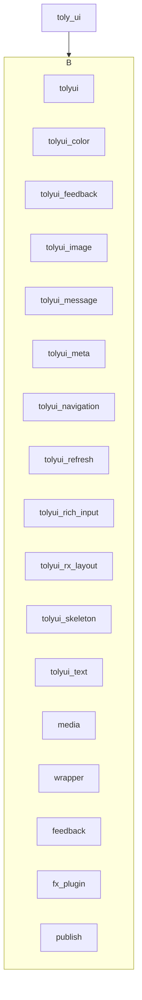
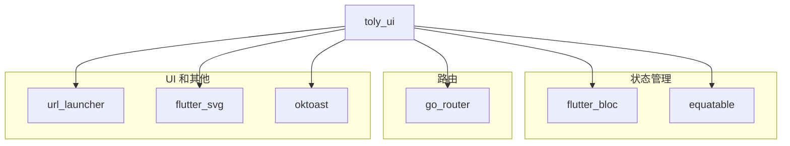
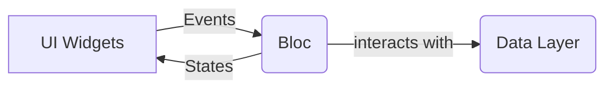
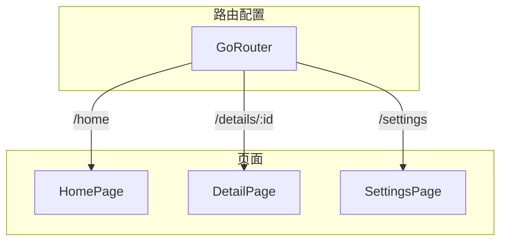
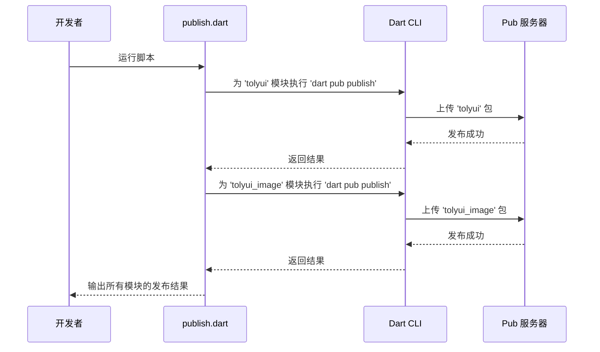

# Toly UI 项目分析

## 1. 项目概述

`toly_ui` 是一个基于 Flutter 的 UI 组件库项目。它采用多模块化的方式组织代码，便于维护、复用和独立发布。该项目旨在提供一套高质量、可定制的 Flutter UI 组件。

## 2. 模块结构

项目核心的 UI 组件和功能被拆分到 `modules` 目录下的多个独立模块中。这种结构使得每个模块都可以独立开发、测试和发布。以下是当前项目包含的模块：



## 3. 主要依赖项

项目依赖了多个第三方库来提供核心功能，以下是主要的依赖项及其关系：



## 4. 应用结构

`lib` 目录是应用的主要代码目录，其结构如下：

```mermaid
treegraph
  root(lib)
    A[main.dart - 应用入口]
    B[app]
      B1[bloc]
      B2[theme]
    C[view]
      C1[pages]
      C2[widgets]
    D[components - 通用组件]
    E[navigation - 路由管理]
```

## 5. 状态管理

项目使用 `flutter_bloc` 库来实现 BLoC (Business Logic Component) 模式进行状态管理。这种模式将业务逻辑与 UI 分离，提高了代码的可测试性和可维护性。



- **UI (Widgets)**: 用户界面，负责展示数据和发送用户事件。
- **Events**: 从 UI 发送到 Bloc 的事件，用于触发业务逻辑。
- **Bloc**: 处理业务逻辑，接收事件并根据事件更新状态。
- **States**: Bloc 输出的状态，UI 根据状态来更新视图。

## 6. 路由管理

项目使用 `go_router` 库进行声明式路由。路由配置很可能集中在 `lib/navigation` 目录中，方便统一管理和维护。



## 7. 构建和发布

项目包含一个位于 `modules/publish.dart` 的发布脚本。该脚本自动化了各个模块的发布流程。

该脚本会遍历 `modules` 目录下的所有模块，并执行 `dart pub publish` 命令来将它们发布到 pub.dev 或私有的 pub 服务器。


