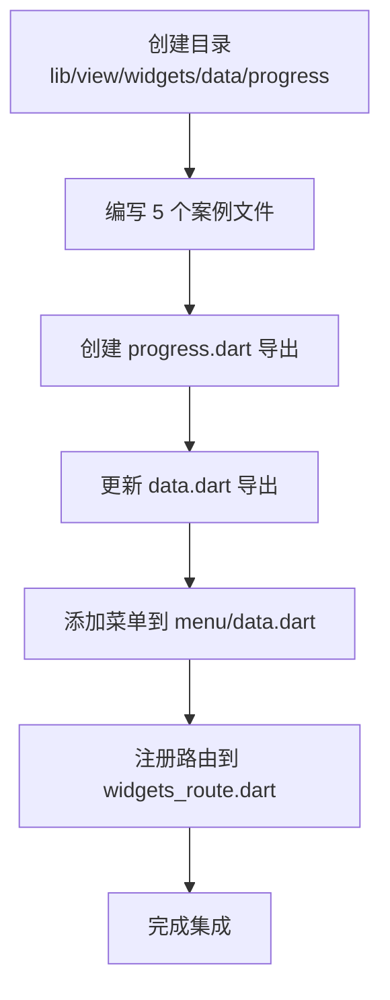

# TolyUI 组件快速集成指南

本文档以 Progress 组件为例，说明如何快速集成新组件到 TolyUI 框架。

## 集成步骤

### 1. 创建组件目录

```bash
mkdir -p lib/view/widgets/{module}/{component}
```

示例：
```bash
mkdir -p lib/view/widgets/data/progress
```

### 2. 编写案例文件

在组件目录下创建案例文件，按照从简单到复杂的顺序命名：

```
progress/
├── progress_demo1.dart  # 基础进度条
├── progress_demo2.dart  # 圆形进度条
├── progress_demo3.dart  # 不确定进度
├── progress_demo4.dart  # 自定义颜色
└── progress_demo5.dart  # 动态进度
```

每个案例使用 `@DisplayNode` 注解：

```dart
import 'package:flutter/material.dart';
import 'package:toly_ui/view/widgets/display_nodes/display_nodes.dart';

@DisplayNode(
  title: '基础进度条',
  desc: '展示进度条的基本用法。通过 value 属性控制进度百分比...',
)
class ProgressDemo1 extends StatelessWidget {
  const ProgressDemo1({super.key});

  @override
  Widget build(BuildContext context) {
    return const LinearProgressIndicator(value: 0.5);
  }
}
```

### 3. 创建组件导出文件

在组件目录下创建 `{component}.dart`：

```dart
// lib/view/widgets/data/progress/progress.dart
export 'progress_demo1.dart';
export 'progress_demo2.dart';
export 'progress_demo3.dart';
export 'progress_demo4.dart';
export 'progress_demo5.dart';
```

### 4. 更新模块导出

在模块导出文件中添加组件导出：

```dart
// lib/view/widgets/data/data.dart
export 'progress/progress.dart';
```

### 5. 添加菜单配置

在对应模块的菜单文件中添加菜单项：

```dart
// lib/navigation/menu/data.dart
{
  'path': '/progress',
  'label': 'Progress',
  'subtitle': '进度条',
  'isFlutter': true,  // 可选：标记为 Flutter 原生组件
}
```

### 6. 注册路由

在路由配置文件中添加路由：

```dart
// lib/navigation/router/widgets_route.dart
GoRoute(
  path: 'data',
  routes: [
    _customRoute('progress'),  // 添加这一行
    // 其他路由...
  ]
)
```

## 完整示例：Progress 组件集成



### 文件清单

```
lib/view/widgets/data/progress/
├── progress_demo1.dart          # 基础进度条
├── progress_demo2.dart          # 圆形进度条
├── progress_demo3.dart          # 不确定进度
├── progress_demo4.dart          # 自定义颜色
├── progress_demo5.dart          # 动态进度
└── progress.dart                # 导出文件

lib/view/widgets/data/
└── data.dart                    # 添加 export 'progress/progress.dart'

lib/navigation/menu/
└── data.dart                    # 添加 progress 菜单项

lib/navigation/router/
└── widgets_route.dart           # 添加 _customRoute('progress')
```

## 核心要点

1. **目录结构**：`lib/view/widgets/{module}/{component}/`
2. **文件命名**：`{component}_demo{number}.dart`
3. **注解标注**：每个案例必须使用 `@DisplayNode` 注解
4. **导出层级**：组件导出 → 模块导出 → 顶层导出
5. **路径一致**：菜单 path 必须与路由 path 一致（小写）

## 检查清单

集成完成后，确认以下事项：

- [ ] 组件目录已创建
- [ ] 案例文件已编写，包含 `@DisplayNode` 注解
- [ ] 组件导出文件已创建
- [ ] 模块导出文件已更新
- [ ] 菜单配置已添加
- [ ] 路由已注册
- [ ] 菜单 path 与路由 path 一致

## 验证集成

启动应用后：

1. 在左侧菜单找到对应模块（如 Data 数据展示）
2. 点击组件菜单项（如 Progress）
3. 右侧展示页面应显示所有案例
4. 每个案例可以独立预览和交互

## 常见问题

**Q: 案例没有显示？**
- 检查是否添加了 `@DisplayNode` 注解
- 检查导出文件是否正确
- 检查路由路径是否与菜单一致

**Q: 菜单点击无反应？**
- 检查路由是否注册
- 检查路径是否使用小写

**Q: 案例顺序不对？**
- 案例按文件名排序，使用 `demo1`、`demo2` 等数字后缀

---

更新时间：2024-01-15  
参考案例：Progress 组件集成
