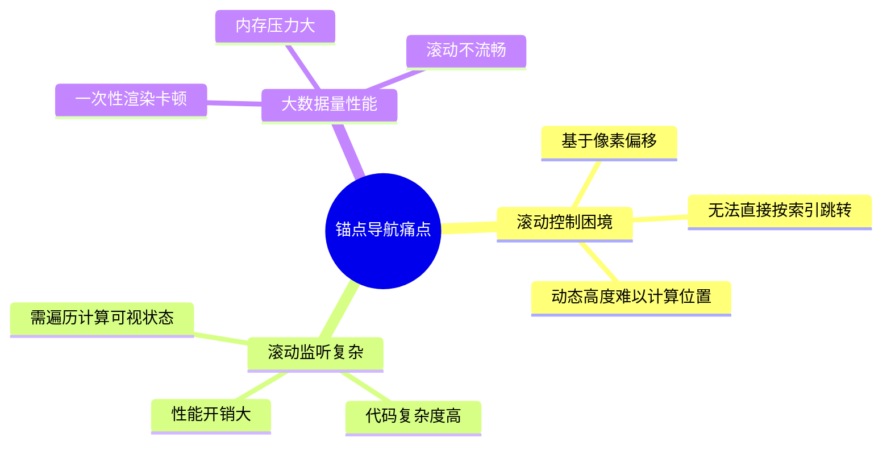
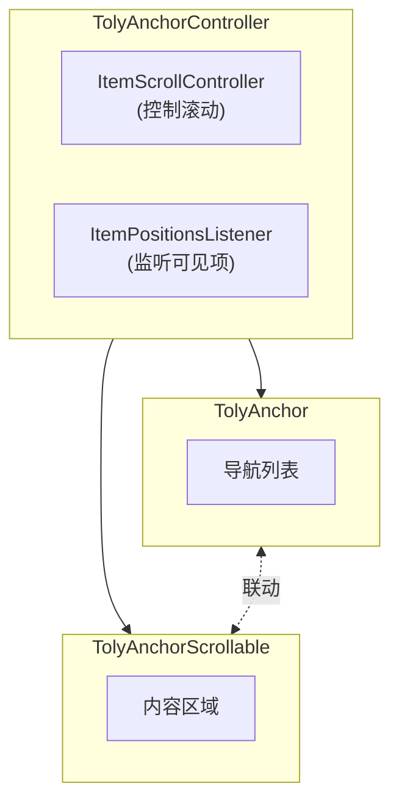
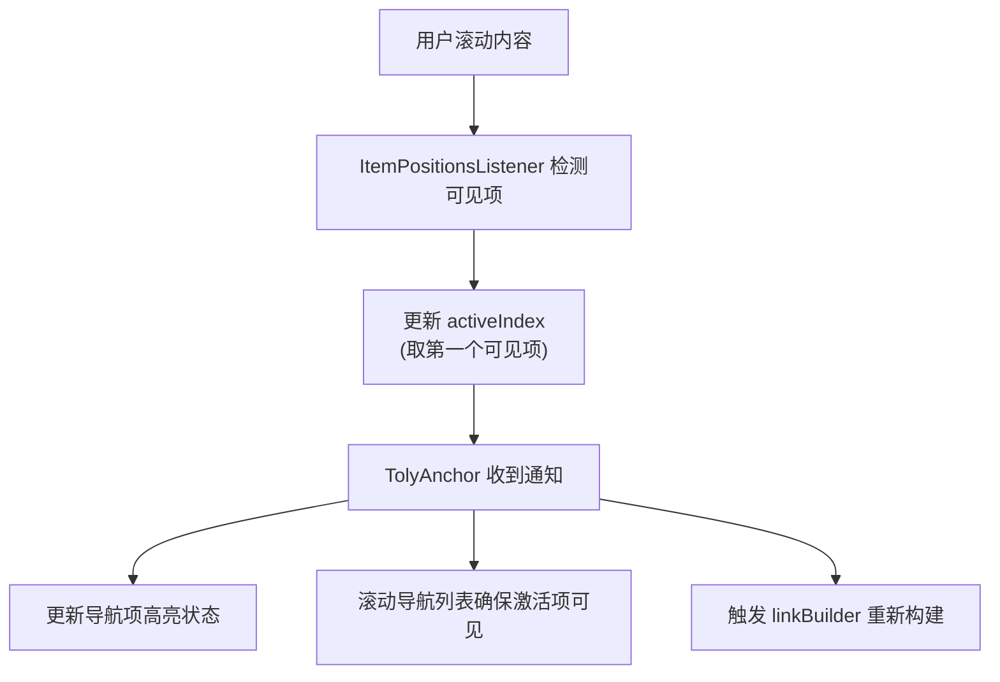
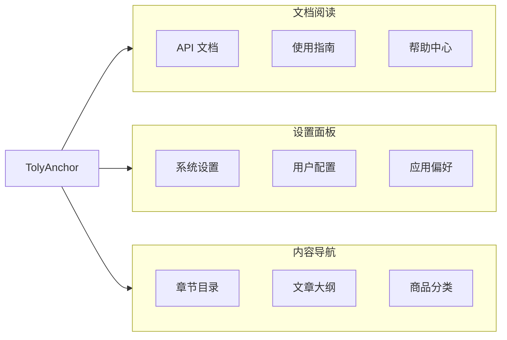
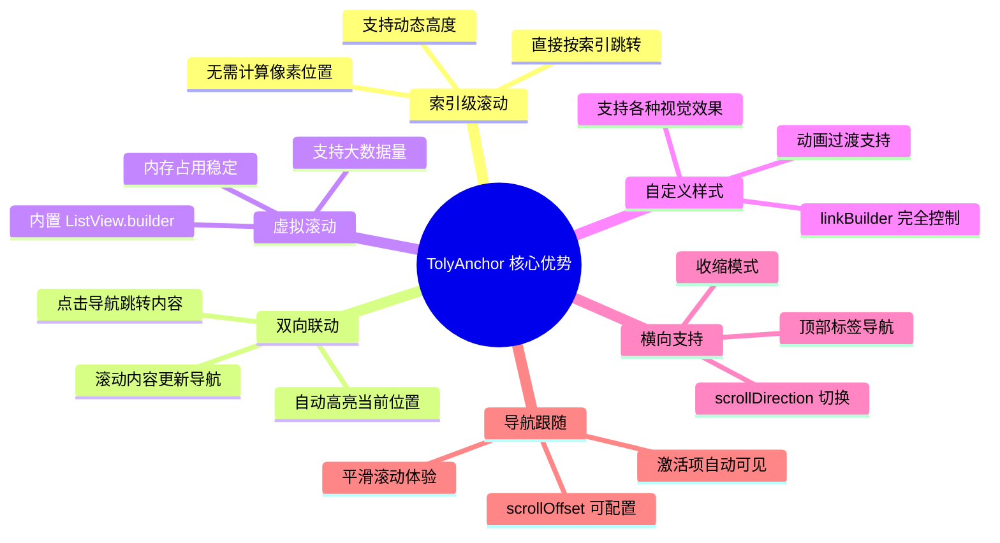

#### 《Flutter TolyUI 框架》系列前言:

**TolyUI** 是 [张风捷特烈](https://juejin.cn/user/149189281194766) 打造的 Fluter 全平台应用开发 UI 框架。具备 **全平台**、**组件化**、**源码开放**、**响应式** 四大特点。可以帮助开发者迅速构建具有响应式全平台应用软件：

> 开源地址： <https://github.com/TolyFx/toly_ui>


---

#### 1. 设计动机

在文档阅读、设置面板、目录导航等场景中，锚点导航是一种极其常见的交互模式。用户需要快速跳转到指定内容区域，同时在滚动时自动高亮当前位置。然而，Flutter 原生的滚动控制基于像素偏移，无法直接按索引跳转，且在处理大量数据时存在性能瓶颈。


具体来说，开发者面临以下痛点：



**1. 滚动控制的困境**

Flutter 的 `ScrollController` 提供 `animateTo` 和 `jumpTo` 方法，但它们接受的是像素偏移值。要滚动到第 10 个元素，需要先计算该元素的准确位置，这在动态高度的列表中几乎不可能。

```dart
// 传统方式的困境：需要知道精确的像素位置
_scrollController.animateTo(
  1200.0,  // 如何知道第 N 个元素在 1200 像素处？
  duration: Duration(milliseconds: 300),
  curve: Curves.easeInOut,
);
```

**2. 滚动监听的复杂**

监听滚动位置并高亮对应的导航项，需要遍历所有元素计算其可视状态，代码复杂且性能堪忧。

**3. 大数据量的性能**

当导航项数量达到数百个时，一次性渲染所有导航项会导致明显的卡顿和内存压力。

TolyUI 的 [tolyui_anchor](https://pub.dev/packages/tolyui_anchor) 模块正是为了解决这些痛点而设计。它基于 `ScrollablePositionedList` 实现索引级滚动控制，支持精确跳转到指定项，内置虚拟滚动确保大数据量下的流畅体验，同时提供自动高亮和导航跟随等交互能力。

使用者可以独立引入模块包，或者使用 tolyui 全家桶：

```yaml
# 仅使用 tolyui_anchor
dependencies: 
   tolyui_anchor: ^last_version

# 使用 tolyui 全家桶 
dependencies: 
    tolyui: ^last_version
```

---

#### 2. 核心概念

TolyAnchor 组件由两个核心部件组成，它们通过 `TolyAnchorController` 控制器进行协调：

**组件架构图**



**TolyAnchorController**

控制器是连接导航列表和内容区域的桥梁，它内部封装了两个核心对象：

```dart
class TolyAnchorController extends ChangeNotifier {
  /// 底层滚动控制器，用于控制 ScrollablePositionedList
  /// 这是一个特殊的控制器，支持按索引滚动而非像素滚动
  final ItemScrollController itemScrollController = ItemScrollController();
  
  /// 位置监听器，用于获取当前可见的项
  /// 它会实时追踪哪些索引项在视口中可见
  final ItemPositionsListener itemPositionsListener = ItemPositionsListener.create();
  
  /// 当前激活的索引（只读）
  /// 激活索引是根据 itemPositionsListener 自动计算得出的
  int _activeIndex = 0;
  int get activeIndex => _activeIndex;
  
  /// 当前激活的标签（兼容旧 API）
  /// 格式为 'item_$index'，如 'item_0', 'item_1' 等
  String? get activeTag => 'item_$_activeIndex';
  
  /// 滚动到指定索引
  /// [index] 目标索引，从 0 开始
  /// [duration] 动画时长，默认 300ms
  /// [curve] 动画曲线，默认 easeInOut
  Future<void> scrollToIndex(
    int index, {
    Duration duration = const Duration(milliseconds: 300),
    Curve curve = Curves.easeInOut,
  });
  
  /// 滚动到指定标签
  /// [tag] 标签标识，会自动解析为索引
  /// 例如 scrollTo('item_5') 等价于 scrollToIndex(5)
  Future<void> scrollTo(String tag, {Duration duration, Curve curve});
  
  /// 无动画跳转到指定索引
  /// 适用于快速定位或初始化场景
  void jumpToIndex(int index);
}
```

**工作原理**

当用户滚动内容区域时，`ItemPositionsListener` 会实时监听当前可见的项，并更新 `activeIndex`。`TolyAnchor` 监听 `activeIndex` 的变化，更新对应的导航项样式，并确保激活项在导航列表中可见。



**TolyAnchorLink**

数据模型定义锚点链接的基本信息：

```dart
class TolyAnchorLink {
  /// 显示标题
  final String title;
  
  /// 锚点标识，用于 scrollTo(tag) 方法
  final String href;
  
  /// 子节点（预留，未来支持多级导航）
  final List<TolyAnchorLink>? children;

  const TolyAnchorLink({
    required this.title,
    required this.href,
    this.children,
  });
}
```

---

#### 3. 基础用法

最简单的使用方式是将 `TolyAnchor` 和 `TolyAnchorScrollable` 左右并排布局，通过同一个 `TolyAnchorController` 实例连接。


**核心步骤**

使用 TolyAnchor 只需四个步骤：

1. **创建控制器**：在 State 中创建 `TolyAnchorController` 实例
2. **定义数据**：创建 `List<TolyAnchorLink>` 作为导航数据源
3. **连接组件**：将同一个控制器实例传递给 `TolyAnchor` 和 `TolyAnchorScrollable`
4. **释放资源**：在 `dispose` 中调用控制器的 `dispose` 方法

**完整示例**

```dart
import 'package:flutter/material.dart';
import 'package:tolyui_anchor/tolyui_anchor.dart';

class AnchorBasicDemo extends StatefulWidget {
  const AnchorBasicDemo({super.key});

  @override
  State<AnchorBasicDemo> createState() => _AnchorBasicDemoState();
}

class _AnchorBasicDemoState extends State<AnchorBasicDemo> {
  // 1. 创建控制器
  final TolyAnchorController _controller = TolyAnchorController();

  // 2. 定义导航数据
  final List<TolyAnchorLink> _links = const [
    TolyAnchorLink(title: '概览', href: 'overview'),
    TolyAnchorLink(title: '特性', href: 'features'),
    TolyAnchorLink(title: '安装', href: 'installation'),
    TolyAnchorLink(title: '快速开始', href: 'quick-start'),
    TolyAnchorLink(title: 'API', href: 'api'),
  ];

  @override
  void dispose() {
    // 3. 记得释放控制器
    _controller.dispose();
    super.dispose();
  }

  @override
  Widget build(BuildContext context) {
    return SizedBox(
      height: 400,
      child: Row(
        crossAxisAlignment: CrossAxisAlignment.start,
        children: [
          // 左侧导航
          SizedBox(
            width: 150,
            child: TolyAnchor(
              controller: _controller,
              links: _links,
            ),
          ),
          const VerticalDivider(),
          // 右侧内容
          Expanded(
            child: TolyAnchorScrollable(
              controller: _controller,
              itemCount: _links.length,
              itemBuilder: (context, index) => _buildSection(index),
            ),
          ),
        ],
      ),
    );
  }

  Widget _buildSection(int index) {
    final link = _links[index];

    return Container(
      padding: const EdgeInsets.all(24),
      child: Column(
        crossAxisAlignment: CrossAxisAlignment.start,
        children: [
          Text(
            link.title,
            style: const TextStyle(
              fontSize: 24,
              fontWeight: FontWeight.bold,
            ),
          ),
          const SizedBox(height: 16),
          Text(
            '这是 ${link.title} 部分的内容。点击左侧导航可快速跳转到对应区域。',
            style: const TextStyle(fontSize: 14),
          ),
        ],
      ),
    );
  }
}
```

**交互说明**

- **点击导航**：点击左侧导航项，右侧内容会平滑滚动到对应位置
- **滚动联动**：滚动右侧内容时，左侧导航会自动高亮当前可见区域对应的项
- **导航跟随**：当激活项超出左侧导航的可视区域时，导航列表会自动滚动确保激活项可见

**布局结构说明**

```mermaid
block-beta
    columns 3
    
    block:header:1
        A["Row (横向布局)"]
    end
    
    block:left:1
        L1["TolyAnchor"]
        L2["(固定宽度 150px)"]
        L3["- 概览"]
        L4["- 特性"]
        L5["- 安装"]
        L6["- ..."]
    end
    
    block:divider:1
        D1["|"]
        D2["|"]
        D3["|"]
        D4["|"]
        D5["|"]
        D6["|"]
    end
    
    block:right:1
        R1["TolyAnchorScrollable"]
        R2["(Expanded)"]
        R3["概览内容"]
        R4["特性内容"]
        R5["安装内容"]
        R6["..."]
    end
```



**关键代码解析**

```dart
// TolyAnchor 组件参数说明
TolyAnchor(
  controller: _controller,  // 必需：控制器实例，连接导航和内容
  links: _links,            // 必需：导航数据列表
)

// TolyAnchorScrollable 组件参数说明
TolyAnchorScrollable(
  controller: _controller,  // 必需：与 TolyAnchor 共享的控制器
  itemCount: _links.length, // 必需：内容项数量，应与 links 长度一致
  itemBuilder: (context, index) => _buildSection(index), // 必需：内容构建器
)
```

---

#### 4. 自定义导航样式

默认的导航样式是简单的左侧边框高亮效果。通过 `linkBuilder` 参数可以完全自定义导航项的渲染效果，适用于设置面板、分类导航等场景。


**linkBuilder 签名**

```dart
typedef TolyAnchorLinkBuilder = Widget Function(
  BuildContext context,  // 构建上下文
  TolyAnchorLink link,   // 当前导航项数据
  bool active,           // 是否为激活状态
);
```

当使用 `linkBuilder` 时，你需要：
1. 根据 `active` 参数渲染不同的样式（如背景色、字体粗细、边框等）
2. 自行处理点击事件（通过 `InkWell` 或 `GestureDetector`）
3. 在点击回调中调用 `_controller.scrollToIndex(index)` 实现跳转

**设置面板样式示例**

以下示例模拟飞书桌面端的设置面板，左侧为分组导航，右侧为对应的设置内容：

```dart
// 定义设置分组数据模型
class _SettingGroup {
  final String title;       // 分组标题
  final IconData icon;      // 分组图标
  final List<_SettingItem> items; // 分组下的设置项

  const _SettingGroup({
    required this.title,
    required this.icon,
    required this.items,
  });
}

// 定义设置项数据模型
class _SettingItem {
  final String title;       // 设置项标题
  final String description; // 设置项描述

  const _SettingItem({
    required this.title,
    required this.description,
  });
}

// 定义分组数据
final List<_SettingGroup> _groups = const [
  _SettingGroup(
    title: '通用',
    icon: Icons.settings_outlined,
    items: [
      _SettingItem(title: '外观', description: '自定义主题、字体、界面密度'),
      _SettingItem(title: '通知', description: '管理桌面通知和消息提醒'),
      _SettingItem(title: '语言', description: '选择界面显示语言'),
    ],
  ),
  _SettingGroup(
    title: '账号',
    icon: Icons.person_outline,
    items: [
      _SettingItem(title: '个人信息', description: '编辑头像、昵称等资料'),
      _SettingItem(title: '安全设置', description: '密码、两步验证'),
    ],
  ),
];

// 从分组数据生成导航链接
late final List<TolyAnchorLink> _links = _groups.map((g) => 
  TolyAnchorLink(title: g.title, href: g.title)
).toList();

@override
Widget build(BuildContext context) {
  return Row(
    children: [
      // 左侧导航栏 - 固定宽度 200px
      SizedBox(
        width: 200,
        child: TolyAnchor(
          controller: _controller,
          links: _links,
          linkBuilder: _buildGroupLink,  // 自定义渲染
        ),
      ),
      // 分隔线
      const VerticalDivider(),
      // 右侧内容区域 - 占满剩余空间
      Expanded(
        child: TolyAnchorScrollable(
          controller: _controller,
          itemCount: _groups.length,
          itemBuilder: (context, index) => _buildGroupSection(index),
        ),
      ),
    ],
  );
}

// 自定义导航项渲染
Widget _buildGroupLink(BuildContext context, TolyAnchorLink link, bool active) {
  // 根据 link.title 找到对应的分组数据
  final group = _groups.firstWhere((g) => g.title == link.title);
  // 获取索引，用于点击时跳转
  final index = _groups.indexOf(group);

  return InkWell(
    onTap: () => _controller.scrollToIndex(index),  // 点击跳转到对应索引
    child: Container(
      padding: const EdgeInsets.symmetric(horizontal: 16, vertical: 14),
      decoration: BoxDecoration(
        // 激活时的背景色（主题色的 8% 透明度）
        color: active 
            ? Theme.of(context).colorScheme.primary.withValues(alpha: 0.08) 
            : null,
        // 左侧高亮边框（3px 宽）
        border: Border(
          left: BorderSide(
            color: active 
                ? Theme.of(context).colorScheme.primary 
                : Colors.transparent,
            width: 3,
          ),
        ),
      ),
      child: Row(
        children: [
          // 图标
          Icon(
            group.icon,
            size: 20,
            color: active 
                ? Theme.of(context).colorScheme.primary 
                : Colors.grey.shade600,
          ),
          const SizedBox(width: 12),
          // 文字
          Text(
            group.title,
            style: TextStyle(
              fontSize: 14,
              fontWeight: active ? FontWeight.w600 : FontWeight.normal,
              color: active 
                  ? Theme.of(context).colorScheme.primary 
                  : Colors.grey.shade800,
            ),
          ),
        ],
      ),
    ),
  );
}
```

**样式定制技巧**

在自定义 `linkBuilder` 时，可以使用以下技巧实现不同的视觉效果：

```dart
// 技巧 1：使用不同形状的指示器
BoxDecoration(
  // 左侧圆点指示器
  border: Border(left: BorderSide(...)),
  // 或底部线条指示器
  // border: Border(bottom: BorderSide(...)),
  // 或圆角背景
  // borderRadius: BorderRadius.circular(8),
)

// 技巧 2：动态字体样式
TextStyle(
  fontSize: active ? 15 : 14,  // 激活时稍大
  fontWeight: active ? FontWeight.w600 : FontWeight.normal,
  color: active 
      ? Theme.of(context).colorScheme.primary 
      : Colors.grey.shade700,
)

// 技巧 3：添加动画过渡
AnimatedContainer(
  duration: const Duration(milliseconds: 200),
  decoration: BoxDecoration(
    color: active ? Colors.blue.shade50 : null,
    // ... 其他样式
  ),
  child: YourWidget(),
)
```

**注意事项**

- 在 `linkBuilder` 中调用 `scrollToIndex` 时，需要自行获取索引值
- 如果自定义了 `linkBuilder`，默认的点击行为不会生效，需要手动添加 `InkWell` 或 `GestureDetector`
- `linkBuilder` 会在每次 `activeIndex` 变化时重新调用，请确保方法内部没有耗时操作

---

#### 5. 横向标签导航

`TolyAnchor` 支持横向滚动模式，适用于顶部标签导航场景。通过设置 `scrollDirection: Axis.horizontal` 即可切换为横向布局。


**完整示例**

```dart
class HorizontalAnchorDemo extends StatefulWidget {
  const HorizontalAnchorDemo({super.key});

  @override
  State<HorizontalAnchorDemo> createState() => _HorizontalAnchorDemoState();
}

class _HorizontalAnchorDemoState extends State<HorizontalAnchorDemo> {
  final TolyAnchorController _controller = TolyAnchorController();

  final List<TolyAnchorLink> _links = const [
    TolyAnchorLink(title: '概述', href: 'overview'),
    TolyAnchorLink(title: '快速开始', href: 'quick-start'),
    TolyAnchorLink(title: '核心概念', href: 'concepts'),
    TolyAnchorLink(title: 'API 参考', href: 'api'),
    TolyAnchorLink(title: '最佳实践', href: 'best-practices'),
  ];

  @override
  void dispose() {
    _controller.dispose();
    super.dispose();
  }

  @override
  Widget build(BuildContext context) {
    return SizedBox(
      height: 400,
      child: Column(
        children: [
          // 顶部横向标签导航
          Container(
            height: 48,
            decoration: BoxDecoration(
              color: Colors.grey.shade100,
              border: Border(
                bottom: BorderSide(color: Colors.grey.shade300),
              ),
            ),
            child: TolyAnchor(
              controller: _controller,
              links: _links,
              scrollDirection: Axis.horizontal,  // 横向滚动
              shrinkWrap: true,  // 根据内容收缩
              linkBuilder: _buildTabLink,
            ),
          ),
          // 竖直滚动内容区域
          Expanded(
            child: TolyAnchorScrollable(
              controller: _controller,
              itemCount: _links.length,
              // 内容区域保持默认垂直滚动
              itemBuilder: (context, index) => _buildSection(index),
            ),
          ),
        ],
      ),
    );
  }

  Widget _buildTabLink(BuildContext context, TolyAnchorLink link, bool active) {
    final index = _links.indexOf(link);

    return InkWell(
      onTap: () => _controller.scrollToIndex(index),
      child: Container(
        padding: const EdgeInsets.symmetric(horizontal: 24),
        decoration: BoxDecoration(
          // 底部高亮线
          border: Border(
            bottom: BorderSide(
              color: active 
                  ? Theme.of(context).colorScheme.primary 
                  : Colors.transparent,
              width: 3,
            ),
          ),
        ),
        child: Center(
          child: Text(
            link.title,
            style: TextStyle(
              fontSize: 15,
              fontWeight: active ? FontWeight.w600 : FontWeight.normal,
              color: active 
                  ? Theme.of(context).colorScheme.primary 
                  : Colors.grey.shade700,
            ),
          ),
        ),
      ),
    );
  }

  Widget _buildSection(int index) {
    final link = _links[index];
    return Container(
      padding: const EdgeInsets.all(32),
      child: Column(
        crossAxisAlignment: CrossAxisAlignment.start,
        mainAxisSize: MainAxisSize.min,
        children: [
          Text(link.title, style: const TextStyle(fontSize: 24, fontWeight: FontWeight.bold)),
          const SizedBox(height: 20),
          Text('这是 ${link.title} 的详细内容...'),
        ],
      ),
    );
  }
}
```

**关键配置**

| 参数 | 类型 | 默认值 | 说明 |
|------|------|--------|------|
| `scrollDirection` | `Axis` | `Axis.vertical` | 设置为 `Axis.horizontal` 启用横向布局 |
| `shrinkWrap` | `bool` | `false` | 设置为 `true` 让导航栏根据内容收缩，而不是占满父容器 |

**横向导航与竖直内容的组合模式**

这是一个常见的 UI 模式：顶部横向标签导航 + 竖直滚动内容。关键点在于：

1. **TolyAnchor 设置横向**：`scrollDirection: Axis.horizontal`
2. **TolyAnchorScrollable 保持默认**：不需要特殊设置，默认就是竖直滚动
3. **使用 shrinkWrap**：让横向导航栏高度自适应内容，而不是占满父容器

---

#### 6. 大数据量性能优化

`TolyAnchor` 内部使用 `ListView.builder` 实现虚拟滚动，仅渲染可视区域的导航项。`TolyAnchorScrollable` 基于 `ScrollablePositionedList`，同样支持按需构建。


即使有 300 个锚点项，内存占用也保持稳定，滚动过程流畅无卡顿。

**大量数据示例**

```dart
class LargeDataAnchorDemo extends StatefulWidget {
  const LargeDataAnchorDemo({super.key});

  @override
  State<LargeDataAnchorDemo> createState() => _LargeDataAnchorDemoState();
}

class _LargeDataAnchorDemoState extends State<LargeDataAnchorDemo> {
  final TolyAnchorController _controller = TolyAnchorController();
  final ScrollController _navScrollController = ScrollController(keepScrollOffset: false);

  late final List<TolyAnchorLink> _links;
  late final List<_NavItem> _items;

  @override
  void initState() {
    super.initState();
    _generateItems();
  }

  void _generateItems() {
    // 生成 300 个测试项
    _items = List.generate(300, (index) {
      return _NavItem(
        tag: 'item_$index',
        title: '章节 ${index + 1}',
        subtitle: '这是第 ${index + 1} 个测试章节的内容描述' * ((index + 1) % 10),
      );
    });

    _links = _items.map((item) => TolyAnchorLink(
      title: item.title,
      href: item.tag,
    )).toList();
  }

  @override
  void dispose() {
    _controller.dispose();
    _navScrollController.dispose();
    super.dispose();
  }

  @override
  Widget build(BuildContext context) {
    return Row(
      children: [
        // 左侧导航 - 使用虚拟滚动
        Container(
          width: 140,
          child: TolyAnchor(
            controller: _controller,
            links: _links,
            scrollController: _navScrollController,  // 可选的外部控制器
            linkBuilder: _buildCompactLink,
          ),
        ),
        // 右侧内容 - 同样按需构建
        Expanded(
          child: TolyAnchorScrollable(
            controller: _controller,
            itemCount: _links.length,
            itemBuilder: (context, index) => _buildItem(index),
          ),
        ),
      ],
    );
  }

  Widget _buildCompactLink(BuildContext context, TolyAnchorLink link, bool active) {
    final index = _links.indexOf(link);
    
    return InkWell(
      onTap: () => _controller.scrollToIndex(index),
      child: Container(
        padding: const EdgeInsets.symmetric(horizontal: 12, vertical: 8),
        decoration: BoxDecoration(
          color: active ? Theme.of(context).colorScheme.primary.withValues(alpha: 0.1) : null,
        ),
        child: Text(
          link.title,
          style: TextStyle(
            fontWeight: active ? FontWeight.w600 : FontWeight.normal,
            color: active ? Theme.of(context).colorScheme.primary : Colors.grey.shade700,
          ),
        ),
      ),
    );
  }
}
```

**性能要点**

1. **TolyAnchor** 内部使用 `ListView.builder`，自动实现虚拟滚动
2. **TolyAnchorScrollable** 基于 `ScrollablePositionedList`，同样按需构建
3. 当激活项超出可视区域时，导航列表会自动滚动确保可见

---

#### 7. 高级特性

**滚动控制 API**

```dart
// 滚动到指定索引（带动画）
await _controller.scrollToIndex(
  5,
  duration: const Duration(milliseconds: 300),
  curve: Curves.easeInOut,
);

// 无动画跳转（适用于快速定位）
_controller.jumpToIndex(5);

// 通过标签滚动
await _controller.scrollTo('section-1');

// 获取当前激活索引
int current = _controller.activeIndex;
```

**激活项跟随**

当内容滚动时，左侧导航会自动高亮当前可见区域对应的项。如果激活项超出导航列表的可视区域，导航列表会自动滚动确保激活项可见。

```dart
TolyAnchor(
  controller: _controller,
  links: _links,
  scrollOffset: 20.0,  // 激活项距离边缘的偏移量（默认 20）
)
```

**shrinkWrap 参数**

当需要让导航列表根据内容收缩时，设置 `shrinkWrap: true`：

```dart
// 默认：导航列表占满父容器高度
TolyAnchor(
  controller: _controller,
  links: _links,
  shrinkWrap: false,  // 默认
)

// 收缩模式：导航列表高度等于所有项之和
TolyAnchor(
  controller: _controller,
  links: _links,
  shrinkWrap: true,
)
```

**自定义滚动控制器**

可以传入外部的 `ScrollController` 以便进行更精细的控制：

```dart
final ScrollController _navController = ScrollController();

TolyAnchor(
  controller: _controller,
  links: _links,
  scrollController: _navController,  // 外部控制器
)

// 外部控制滚动
_navController.animateTo(
  100.0,
  duration: const Duration(milliseconds: 200),
  curve: Curves.easeInOut,
);
```

---

#### 8. 常见问题

**Q: 为什么滚动时左侧导航不跟随高亮？**

确保 `TolyAnchor` 和 `TolyAnchorScrollable` 使用的是同一个 `TolyAnchorController` 实例：

```dart
// ❌ 错误：使用了不同的控制器
TolyAnchor(controller: TolyAnchorController(), ...)
TolyAnchorScrollable(controller: TolyAnchorController(), ...)

// ✅ 正确：使用同一个控制器实例
final controller = TolyAnchorController();
TolyAnchor(controller: controller, ...)
TolyAnchorScrollable(controller: controller, ...)
```

**Q: 如何在点击导航时阻止动画？**

使用 `jumpToIndex` 方法代替 `scrollToIndex`：

```dart
// 有动画
await _controller.scrollToIndex(5);

// 无动画
_controller.jumpToIndex(5);
```

**Q: 如何获取当前激活项的信息？**

```dart
// 获取当前索引
int index = _controller.activeIndex;

// 获取当前标签
String? tag = _controller.activeTag;

// 监听变化
_controller.addListener(() {
  print('当前激活: ${_controller.activeIndex}');
});
```

**Q: 为什么自定义 linkBuilder 后点击无效？**

当使用自定义 `linkBuilder` 时，需要手动添加点击处理：

```dart
Widget _buildLink(BuildContext context, TolyAnchorLink link, bool active) {
  final index = _links.indexOf(link);
  
  // 必须添加 InkWell 或 GestureDetector
  return InkWell(
    onTap: () => _controller.scrollToIndex(index),
    child: YourCustomWidget(),
  );
}
```

---

#### 9. API 参考

**TolyAnchor 组件**

| 参数名 | 类型 | 默认值 | 必需 | 说明 |
|--------|------|--------|------|------|
| `controller` | `TolyAnchorController` | - | ✅ | 控制器实例，连接导航和内容区域 |
| `links` | `List<TolyAnchorLink>` | - | ✅ | 导航数据列表 |
| `linkBuilder` | `TolyAnchorLinkBuilder` | `null` | ❌ | 自定义导航项构建器 |
| `scrollDirection` | `Axis` | `Axis.vertical` | ❌ | 滚动方向，可选 `vertical` 或 `horizontal` |
| `shrinkWrap` | `bool` | `false` | ❌ | 是否根据内容收缩，适用于横向导航 |
| `scrollController` | `ScrollController` | `null` | ❌ | 外部滚动控制器，用于精细控制 |
| `scrollOffset` | `double` | `20.0` | ❌ | 激活项距离边缘的偏移量 |
| `padding` | `EdgeInsetsGeometry` | `EdgeInsets.zero` | ❌ | 导航列表内边距 |

**TolyAnchorScrollable 组件**

| 参数名 | 类型 | 默认值 | 必需 | 说明 |
|--------|------|--------|------|------|
| `controller` | `TolyAnchorController` | - | ✅ | 控制器实例，与 TolyAnchor 共享 |
| `itemCount` | `int` | - | ✅ | 内容项数量，应与 links 长度一致 |
| `itemBuilder` | `IndexedWidgetBuilder` | - | ✅ | 内容构建器，按索引构建每个内容项 |
| `scrollDirection` | `Axis` | `Axis.vertical` | ❌ | 滚动方向，默认竖直 |
| `reverse` | `bool` | `false` | ❌ | 是否反向滚动 |
| `anchor` | `double` | `0.0` | ❌ | 滚动锚点，0.0 表示顶部，1.0 表示底部 |

**TolyAnchorController 方法**

| 方法名 | 参数 | 返回值 | 说明 |
|--------|------|--------|------|
| `scrollToIndex` | `int index, Duration duration, Curve curve` | `Future<void>` | 滚动到指定索引（带动画） |
| `jumpToIndex` | `int index` | `void` | 无动画跳转到指定索引 |
| `scrollTo` | `String tag, Duration duration, Curve curve` | `Future<void>` | 滚动到指定标签 |
| `dispose` | - | `void` | 释放资源 |

**TolyAnchorController 属性**

| 属性名 | 类型 | 说明 |
|--------|------|------|
| `activeIndex` | `int` | 当前激活的索引（只读） |
| `activeTag` | `String?` | 当前激活的标签（只读，格式为 `item_$index`） |
| `itemScrollController` | `ItemScrollController` | 底层滚动控制器 |
| `itemPositionsListener` | `ItemPositionsListener` | 位置监听器 |

**TolyAnchorLink 数据模型**

| 属性名 | 类型 | 必需 | 说明 |
|--------|------|------|------|
| `title` | `String` | ✅ | 显示标题 |
| `href` | `String` | ✅ | 锚点标识，用于 `scrollTo(tag)` 方法 |
| `children` | `List<TolyAnchorLink>?` | ❌ | 子节点（预留，未来支持多级导航） |

---

#### 尾声

tolyui_anchor 模块为 Flutter 应用提供了完整的锚点导航能力。从基础的双栏布局到横向标签导航，从简单样式到完全自定义，从少量数据到大数据量虚拟滚动，它都能够胜任。

**适用场景**



组件的设计遵循了职责分离的原则：`TolyAnchor` 负责导航展示和交互，`TolyAnchorScrollable` 负责内容滚动，`TolyAnchorController` 负责状态协调。这种设计使得组件易于理解和扩展。

核心优势总结：



无论你是在构建文档阅读器、设置面板，还是开发内容导航系统，tolyui_anchor 都能帮助你创建出既美观又实用的锚点导航界面。

随着 tolyui 的逐步迭代，越来越多的新功能将会支持。感谢你关注 tolyui 的成长，如果喜欢，也希望你能在 github 中点赞支持~

> github 开源地址： [github.com/TolyFx/toly_ui](https://github.com/TolyFx/toly_ui)
---

更多文章和视频知识资讯，大家可以关注我的公众号、掘金和 B 站 。让我们一起成长，变得更强。我们下次再见~

-    QQ交流群： 1046304516
-   掘金账号： [张风捷特烈](https://juejin.cn/user/149189281194766 "https://juejin.cn/user/149189281194766")
-   bilibli 账号： [张风捷特烈](https://link.juejin.cn?target=https%3A%2F%2Fspace.bilibili.com%2F390457600 "https://space.bilibili.com/390457600")
-   公众号： [编程之王](https://link.juejin.cn?target=https%3A%2F%2Fmp.weixin.qq.com%2Fs%2Fq8Vs5i3SU-4QPoU3-0xOSg "https://mp.weixin.qq.com/s/q8Vs5i3SU-4QPoU3-0xOSg")
