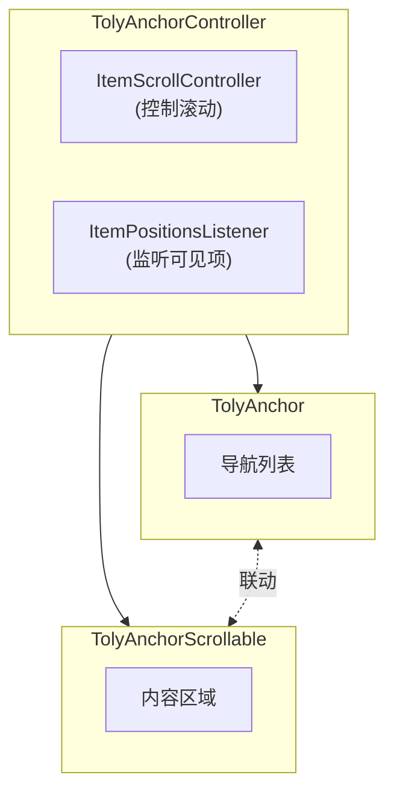
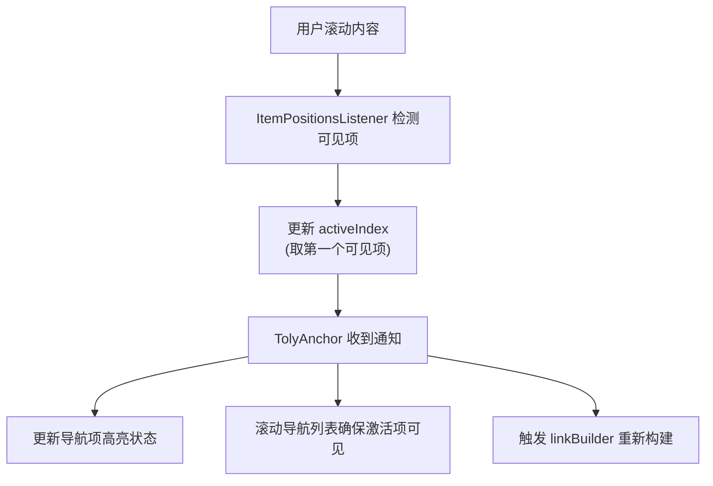
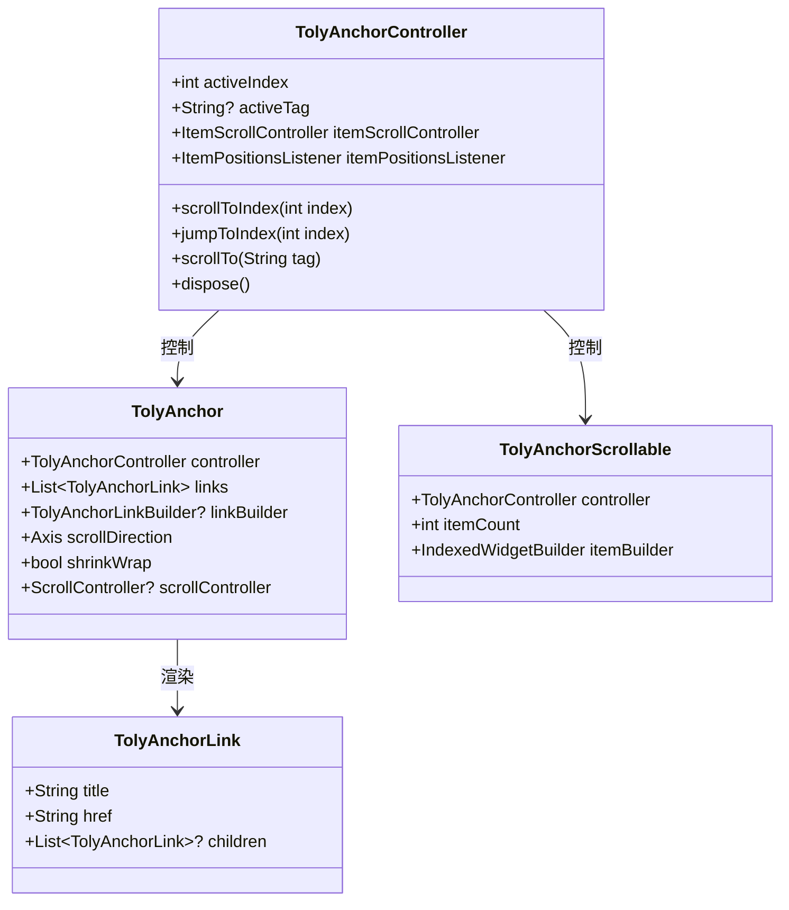
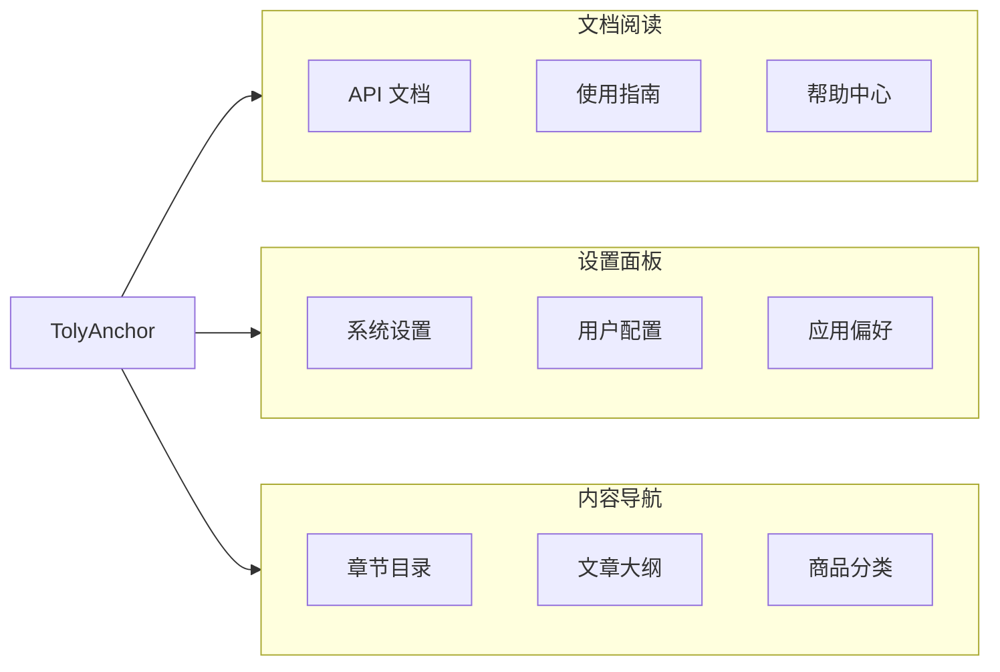

# TolyUI Anchor

使用此技能来添加、修复或解释由本地 `tolyui_anchor` 包提供的锚点导航。

## 组件架构



## 工作原理



## 工作流程

1. 检查目标页面，确认它导入了 `package:tolyui_anchor/tolyui_anchor.dart`。
2. 在 `StatefulWidget` 中为每对导航/内容区域创建一个 `TolyAnchorController`。
3. 将锚点数据定义为 `List<TolyAnchorLink>`，其顺序必须与内容项顺序完全匹配。
4. 使用 `TolyAnchor(controller: ..., links: ...)` 渲染导航。
5. 使用 `TolyAnchorScrollable(controller: ..., itemCount: links.length, itemBuilder: ...)` 渲染内容。
6. 在 `dispose` 中释放控制器。

具体的代码模板和本地示例，请阅读 `references/usage-patterns.md`。

## 核心类型



## 实现规则

- `TolyAnchor` 和 `TolyAnchorScrollable` 必须共用同一个 `TolyAnchorController`。
- 在自定义 `linkBuilder` 的点击事件中，优先使用 `scrollToIndex(index)`，因为它直接匹配列表顺序。
- 仅当功能天然基于标签驱动时才使用 `scrollTo(href)`；`href` 值由 `TolyAnchor` 注册。
- 保持 `links.length`、`itemCount` 和内容数据长度同步。
- 使用 `StatefulWidget` 持有控制器。不要在 `build` 内部创建控制器。
- 对于长左侧导航，向 `TolyAnchor` 传入专用的 `ScrollController(keepScrollOffset: false)` 并在 dispose 中释放。
- 对于横向顶部标签，设置 `TolyAnchor(scrollDirection: Axis.horizontal, shrinkWrap: true)`，通常保持 `TolyAnchorScrollable` 为竖直方向。
- 通过 `linkBuilder(BuildContext context, TolyAnchorLink link, bool active)` 添加自定义激活样式。

## 适用场景



## 参考文档

- `references/usage-patterns.md` - 使用模式和代码模板
- `references/api-reference.md` - API 快速参考
- `references/troubleshooting.md` - 常见问题和解决方案

## 验证

编辑 Flutter 代码后，运行最小范围的检查：

```powershell
flutter analyze
flutter test
```

如果是可视化变更，还需运行应用并验证：

- 点击锚点能滚动内容到对应区域。
- 滚动内容能更新激活的锚点。
- 激活的锚点在长导航列表中保持可见。
- 横向标签不会溢出其固定高度的容器。
