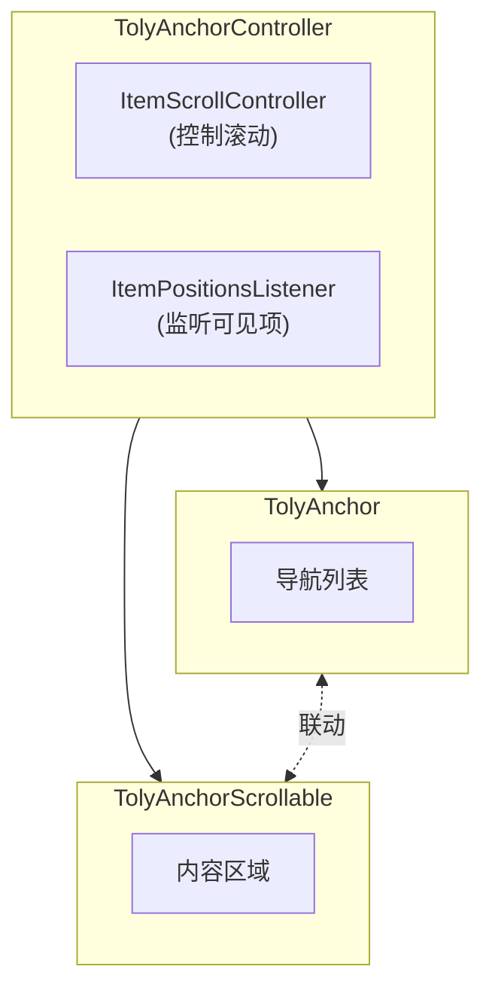

# TolyUI Anchor API 参考

## 组件架构



## TolyAnchor 组件

导航列表组件，用于渲染锚点导航项。

### 参数

| 参数名 | 类型 | 默认值 | 必需 | 说明 |
|--------|------|--------|------|------|
| `controller` | `TolyAnchorController` | - | ✅ | 控制器实例，连接导航和内容区域 |
| `links` | `List<TolyAnchorLink>` | - | ✅ | 导航数据列表 |
| `linkBuilder` | `TolyAnchorLinkBuilder` | `null` | ❌ | 自定义导航项构建器 |
| `scrollDirection` | `Axis` | `Axis.vertical` | ❌ | 滚动方向，可选 `vertical` 或 `horizontal` |
| `shrinkWrap` | `bool` | `false` | ❌ | 是否根据内容收缩，适用于横向导航 |
| `scrollController` | `ScrollController` | `null` | ❌ | 外部滚动控制器，用于精细控制 |
| `scrollOffset` | `double` | `20.0` | ❌ | 激活项距离边缘的偏移量 |
| `padding` | `EdgeInsetsGeometry` | `EdgeInsets.zero` | ❌ | 导航列表内边距 |

### linkBuilder 签名

```dart
typedef TolyAnchorLinkBuilder = Widget Function(
  BuildContext context,  // 构建上下文
  TolyAnchorLink link,   // 当前导航项数据
  bool active,           // 是否为激活状态
);
```

---

## TolyAnchorScrollable 组件

内容滚动组件，基于 `ScrollablePositionedList` 实现。

### 参数

| 参数名 | 类型 | 默认值 | 必需 | 说明 |
|--------|------|--------|------|------|
| `controller` | `TolyAnchorController` | - | ✅ | 控制器实例，与 TolyAnchor 共享 |
| `itemCount` | `int` | - | ✅ | 内容项数量，应与 links 长度一致 |
| `itemBuilder` | `IndexedWidgetBuilder` | - | ✅ | 内容构建器，按索引构建每个内容项 |
| `scrollDirection` | `Axis` | `Axis.vertical` | ❌ | 滚动方向，默认竖直 |
| `reverse` | `bool` | `false` | ❌ | 是否反向滚动 |
| `anchor` | `double` | `0.0` | ❌ | 滚动锚点，0.0 表示顶部，1.0 表示底部 |

---

## TolyAnchorController

控制器，负责协调导航列表和内容区域的联动。

### 构造函数

```dart
TolyAnchorController()
```

### 属性

| 属性名 | 类型 | 说明 |
|--------|------|------|
| `activeIndex` | `int` | 当前激活的索引（只读） |
| `activeTag` | `String?` | 当前激活的标签（只读，格式为 `item_$index`） |
| `itemScrollController` | `ItemScrollController` | 底层滚动控制器 |
| `itemPositionsListener` | `ItemPositionsListener` | 位置监听器 |

### 方法

#### scrollToIndex

滚动到指定索引（带动画）。

```dart
Future<void> scrollToIndex(
  int index, {
  Duration duration = const Duration(milliseconds: 300),
  Curve curve = Curves.easeInOut,
})
```

**参数：**
- `index` - 目标索引，从 0 开始
- `duration` - 动画时长，默认 300ms
- `curve` - 动画曲线，默认 easeInOut

**示例：**

```dart
await _controller.scrollToIndex(5);
```

---

#### jumpToIndex

无动画跳转到指定索引。

```dart
void jumpToIndex(int index)
```

**参数：**
- `index` - 目标索引，从 0 开始

**示例：**

```dart
_controller.jumpToIndex(5);
```

---

#### scrollTo

滚动到指定标签。

```dart
Future<void> scrollTo(
  String tag, {
  Duration duration = const Duration(milliseconds: 300),
  Curve curve = Curves.easeInOut,
})
```

**参数：**
- `tag` - 标签标识，会自动解析为索引
- `duration` - 动画时长
- `curve` - 动画曲线

**示例：**

```dart
await _controller.scrollTo('item_5');
```

---

#### dispose

释放资源。

```dart
void dispose()
```

**示例：**

```dart
@override
void dispose() {
  _controller.dispose();
  super.dispose();
}
```

---

## TolyAnchorLink

锚点链接数据模型。

### 构造函数

```dart
const TolyAnchorLink({
  required String title,
  required String href,
  List<TolyAnchorLink>? children,
})
```

### 属性

| 属性名 | 类型 | 必需 | 说明 |
|--------|------|------|------|
| `title` | `String` | ✅ | 显示标题 |
| `href` | `String` | ✅ | 锚点标识，用于 `scrollTo(tag)` 方法 |
| `children` | `List<TolyAnchorLink>?` | ❌ | 子节点（预留，未来支持多级导航） |

### 示例

```dart
final List<TolyAnchorLink> links = const [
  TolyAnchorLink(title: '概览', href: 'overview'),
  TolyAnchorLink(title: '特性', href: 'features'),
  TolyAnchorLink(title: 'API', href: 'api'),
];
```

---

## 完整使用示例

```dart
class AnchorPage extends StatefulWidget {
  const AnchorPage({super.key});

  @override
  State<AnchorPage> createState() => _AnchorPageState();
}

class _AnchorPageState extends State<AnchorPage> {
  // 1. 创建控制器
  final TolyAnchorController _controller = TolyAnchorController();

  // 2. 定义导航数据
  final List<TolyAnchorLink> _links = const [
    TolyAnchorLink(title: '概览', href: 'overview'),
    TolyAnchorLink(title: '特性', href: 'features'),
    TolyAnchorLink(title: 'API', href: 'api'),
  ];

  @override
  void dispose() {
    // 3. 释放控制器
    _controller.dispose();
    super.dispose();
  }

  @override
  Widget build(BuildContext context) {
    return Row(
      children: [
        // 4. 导航列表
        SizedBox(
          width: 160,
          child: TolyAnchor(
            controller: _controller,
            links: _links,
          ),
        ),
        const VerticalDivider(),
        // 5. 内容区域
        Expanded(
          child: TolyAnchorScrollable(
            controller: _controller,
            itemCount: _links.length,
            itemBuilder: (context, index) => _buildSection(index),
          ),
        ),
      ],
    );
  }

  Widget _buildSection(int index) {
    return Padding(
      padding: const EdgeInsets.all(24),
      child: Text(_links[index].title),
    );
  }
}
```
