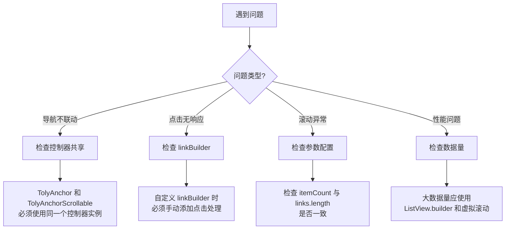

# TolyUI Anchor 常见问题

## 问题诊断流程



---

## 导航联动问题

### 问题：滚动内容时导航不更新高亮

**症状：** 滚动右侧内容区域，左侧导航项的高亮状态不跟随变化。

**原因：** `TolyAnchor` 和 `TolyAnchorScrollable` 使用了不同的控制器实例。

**解决方案：**

```dart
// ❌ 错误：使用了不同的控制器
TolyAnchor(controller: TolyAnchorController(), ...)
TolyAnchorScrollable(controller: TolyAnchorController(), ...)

// ✅ 正确：使用同一个控制器实例
final controller = TolyAnchorController();
TolyAnchor(controller: controller, ...)
TolyAnchorScrollable(controller: controller, ...)
```

---

### 问题：点击导航后内容不滚动

**症状：** 点击左侧导航项，右侧内容区域没有滚动到对应位置。

**原因：** 自定义 `linkBuilder` 时没有添加点击处理。

**解决方案：**

```dart
// ❌ 错误：没有点击处理
Widget _buildLink(BuildContext context, TolyAnchorLink link, bool active) {
  return Container(
    child: Text(link.title),
  );
}

// ✅ 正确：添加 InkWell 处理点击
Widget _buildLink(BuildContext context, TolyAnchorLink link, bool active) {
  final index = _links.indexOf(link);
  
  return InkWell(
    onTap: () => _controller.scrollToIndex(index),
    child: Container(
      child: Text(link.title),
    ),
  );
}
```

---

### 问题：激活项不在导航可视区域

**症状：** 内容滚动后，导航列表没有滚动到激活项位置。

**原因：** 
1. 没有传入稳定的 `ScrollController`
2. 在 `build` 中创建了新的控制器

**解决方案：**

```dart
// ✅ 正确：在 State 中创建控制器，传入 TolyAnchor
class _MyPageState extends State<MyPage> {
  final TolyAnchorController _controller = TolyAnchorController();
  final ScrollController _navController = ScrollController(keepScrollOffset: false);

  @override
  void dispose() {
    _controller.dispose();
    _navController.dispose();
    super.dispose();
  }

  @override
  Widget build(BuildContext context) {
    return TolyAnchor(
      controller: _controller,
      links: _links,
      scrollController: _navController,  // 传入稳定的外部控制器
    );
  }
}
```

---

## 数据同步问题

### 问题：导航和内容数量不匹配

**症状：** 点击最后一个导航项时内容不滚动，或滚动到最后一个内容时导航不更新。

**原因：** `links.length` 与 `itemCount` 不一致。

**解决方案：**

```dart
// ❌ 错误：数量不一致
TolyAnchor(links: _links),  // 假设有 5 个
TolyAnchorScrollable(itemCount: 3),  // 只有 3 个

// ✅ 正确：保持一致
TolyAnchor(links: _links),
TolyAnchorScrollable(itemCount: _links.length),  // 使用同一个数据源
```

---

### 问题：linkBuilder 中获取索引错误

**症状：** 点击导航后跳转到错误的位置。

**原因：** 在 `linkBuilder` 中使用了错误的索引查找方式。

**解决方案：**

```dart
// ✅ 正确：使用 indexOf 获取索引
Widget _buildLink(BuildContext context, TolyAnchorLink link, bool active) {
  final index = _links.indexOf(link);
  return InkWell(
    onTap: () => _controller.scrollToIndex(index),
    child: Text(link.title),
  );
}

// 更好的做法：如果数据量大，使用 Map 缓存索引
late final Map<String, int> _linkIndexMap = {
  for (var i = 0; i < _links.length; i++) _links[i].href: i
};

Widget _buildLink(BuildContext context, TolyAnchorLink link, bool active) {
  final index = _linkIndexMap[link.href]!;
  return InkWell(
    onTap: () => _controller.scrollToIndex(index),
    child: Text(link.title),
  );
}
```

---

## 横向导航问题

### 问题：横向标签溢出容器

**症状：** 顶部横向标签导航超出容器高度。

**原因：** 没有设置 `shrinkWrap: true` 或容器高度不够。

**解决方案：**

```dart
// ✅ 正确：设置 shrinkWrap 和固定高度
SizedBox(
  height: 48,  // 固定高度
  child: TolyAnchor(
    controller: _controller,
    links: _links,
    scrollDirection: Axis.horizontal,  // 横向
    shrinkWrap: true,  // 根据内容收缩
    linkBuilder: _buildTabLink,
  ),
)
```

---

### 问题：横向标签和内容滚动方向都变成横向了

**症状：** 设置横向导航后，内容区域也变成了横向滚动。

**原因：** `TolyAnchorScrollable` 也被错误地设置了横向滚动。

**解决方案：**

```dart
// ❌ 错误：内容也设置了横向
TolyAnchor(scrollDirection: Axis.horizontal, ...)
TolyAnchorScrollable(scrollDirection: Axis.horizontal, ...)

// ✅ 正确：只有导航横向，内容保持竖直
TolyAnchor(scrollDirection: Axis.horizontal, ...)
TolyAnchorScrollable(...)  // 不设置 scrollDirection，默认竖直
```

---

## 性能问题

### 问题：大数据量时导航卡顿

**症状：** 导航项很多（如 100+）时，滚动和点击有明显延迟。

**原因：** 
1. `linkBuilder` 中有耗时操作
2. 没有使用虚拟滚动

**解决方案：**

```dart
// ✅ 正确：保持 linkBuilder 轻量
Widget _buildCompactLink(BuildContext context, TolyAnchorLink link, bool active) {
  // 使用预计算的索引映射，避免每次 indexOf
  final index = _linkIndexMap[link.href]!;
  
  return InkWell(
    onTap: () => _controller.scrollToIndex(index),
    child: Container(
      // 使用简单的样式，避免复杂的计算
      padding: const EdgeInsets.symmetric(horizontal: 12, vertical: 8),
      color: active ? Colors.blue.shade50 : null,
      child: Text(link.title),
    ),
  );
}
```

---

### 问题：控制器重复创建导致状态丢失

**症状：** 页面 rebuild 后，导航状态重置。

**原因：** 在 `build` 方法中创建了控制器。

**解决方案：**

```dart
// ❌ 错误：在 build 中创建
@override
Widget build(BuildContext context) {
  final controller = TolyAnchorController();  // 每次 build 都创建新的
  return TolyAnchor(controller: controller, ...);
}

// ✅ 正确：在 State 中创建
class _MyPageState extends State<MyPage> {
  final TolyAnchorController _controller = TolyAnchorController();
  
  @override
  Widget build(BuildContext context) {
    return TolyAnchor(controller: _controller, ...);
  }
}
```

---

## 类型错误

### 问题：ItemPosition 类型转换错误

**症状：** 出现 `type 'ItemPosition' is not a subtype of type 'double?'` 错误。

**原因：** `PageStorage` 中存储的类型与期望的类型不匹配。

**解决方案：**

这通常发生在 `ScrollablePositionedList` 与 `SingleChildScrollView` 混用时。确保：

1. 不要在 `TolyAnchorScrollable` 外层再包裹 `SingleChildScrollView`
2. 如果需要嵌套滚动，使用 `NeverScrollableScrollPhysics` 禁用内层滚动

```dart
// ❌ 错误：嵌套 SingleChildScrollView
SingleChildScrollView(
  child: TolyAnchorScrollable(...),
)

// ✅ 正确：直接使用 TolyAnchorScrollable
TolyAnchorScrollable(...)
```

---

## 调试技巧

### 打印当前激活索引

```dart
@override
void initState() {
  super.initState();
  _controller.addListener(() {
    print('当前激活索引: ${_controller.activeIndex}');
    print('当前激活标签: ${_controller.activeTag}');
  });
}
```

### 检查可见项

```dart
@override
void initState() {
  super.initState();
  _controller.itemPositionsListener.itemPositions.addListener(() {
    final positions = _controller.itemPositionsListener.itemPositions.value;
    print('可见项: ${positions.map((p) => p.index).toList()}');
  });
}
```

### 验证数据同步

```dart
void _validateData() {
  assert(_links.length == itemCount, 
    'links.length (${_links.length}) 必须等于 itemCount ($itemCount)');
}
```
